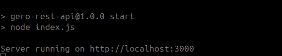
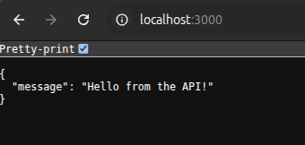
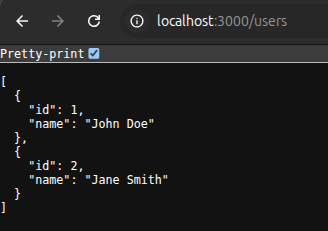

# How to create a NodeJs Rest Api with ExpressJS

## Before to start we need to install NVM (Node Version Manager)

nvm allows you to quickly install and use different versions of node via the command line.

To install or update NVM run the next command

```
curl -o- https://raw.githubusercontent.com/nvm-sh/nvm/v0.40.3/install.sh | bash
```

Examples:

Install specific NodeJs version
```
nvm i 18
```

List the NodeJs versions installed

```
nvm ls
```

Use an specific NodeJs Version

```
nvm use 16
```

## Install NodeJs

Once we have nvm installed, we must install NodeJs, in this case I'm going to work with NodeJs 16

```
nvm i 16
```

## Start to build our Rest Api

```
mkdir gero-rest-api
cd gero-rest-api
npm init -y
```

Then install the libraries

```
npm install express nodemon dotenv babel-cli
```

## Create the index.js file

Create the index.js file and paste the content below on it

```
// index.js
const express = require('express');
const app = express();
const port = 3000;

// Middleware to parse JSON request bodies
app.use(express.json());

// Define a simple GET endpoint
app.get('/', (req, res) => {
    res.json({ message: 'Hello from the API!' });
});

// Start the server
app.listen(port, () => {
    console.log(`Server running on http://localhost:${port}`);
});
```

In the package.json file, add the next propertie in the scripts section:

```
"start": "node index.js"    
```

Now you can run the next command from your terminal

```
npm start
```

You should see the next message in your terminal

```
Server running on http://localhost:3000
``` 




Now you can open your browser and go to http://localhost:3000   

You should see the next message in your browser

```
{"message":"Hello from the API!"}
``` 




## Using routes

Create an env file

```
touch .env
```

Add the next content to the .env file

```
PORT=3000
```

Replace the content of the index.js file with the code below:

``` 
// index.js     
import express  from 'express';
import dotenv from 'dotenv';

dotenv.config();

const port = process.env.PORT || 5000;

import userRoutes from './routers/userRouters.js';

const app = express();

app.use('/users', userRoutes);

app.listen(port, (error) => {
	if(!error)
		console.log("Server is Successfully Running, and App is listening on port " + port)
	else
		console.log("Error occurred, server can't start", error);
	}
);
```

Create a folder called routes and inside create a file called userRoutes.js

```
mkdir routers
cd routers
touch userRouters.js
```

Then paste the code below in the userRoutes.js file

```
// routes/userRoutes.js
import express from 'express';

const router = express.Router();

// At this time, we are going to return static data
let users = [
    { id: 1, name: 'John Doe' },
    { id: 2, name: 'Jane Smith' }
];

router.get('/', async (req, res) => {
    res.send(users);
});

export default router;
```

In the package.json, update the value for the propierte scripts:start

``` 
"start": "nodemon --watch server --exec babel-node index.js"
```

Add the propiertie ```type:module``` in the package.json

```
"type": "module",
```

Now you can run the next command from your terminal

```
npm run start
``` 



