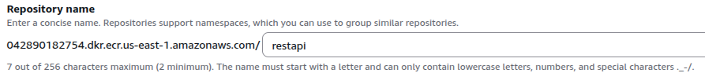

# How to create a Rest Api with NodeJs and ExpressJs

## Before to start we need to install NVM (Node Version Manager)

nvm allows you to quickly install and use different versions of node via the command line.

To install or update NVM, run the command below

```
curl -o- https://raw.githubusercontent.com/nvm-sh/nvm/v0.40.3/install.sh | bash
```

Examples:

Install specific NodeJs version
```
nvm i 18
```

List the NodeJs versions installed

```
nvm ls
```

Use an specific NodeJs Version

```
nvm use 16
```

You can find more info about it, here:

[More Info: NVM](https://github.com/nvm-sh/nvm)


## Install NodeJs

Once we have nvm installed, we must install NodeJs, in this case I'm going to work with NodeJs 16

```
nvm i 16
```

## Start to build our Rest Api

```
mkdir gero-rest-api
cd gero-rest-api
npm init -y
```

Then install the libraries

```
npm install express nodemon dotenv babel-cli
```

## Create the index.js file

Create the index.js file and paste the content below on it

```
// index.js
import express  from 'express';
const app = express();
const port = 3000;

// Define a simple GET endpoint
app.get('/', (req, res) => {
    res.json({ message: 'Hello from the API!' });
});

// Start the server
app.listen(port, () => {
    console.log(`Server running on http://localhost:${port}`);
});
```

In the package.json file, add the next propertie in the scripts section:

```
"start": "node index.js"
```

Now you can run the next command from your terminal

```
npm start
```

You should see the next message in your terminal

```
Server running on http://localhost:3000
``` 


Now you can open your browser and go to http://localhost:3000   

You should see the next message in your browser

```
{"message":"Hello from the API!"}
``` 


## Using routes

Create an env file

```
touch .env
```

Add the next content to the .env file

```
PORT=3000
```

Replace the content of the index.js file with the code below:

``` 
// index.js     
import express from 'express';
import dotenv from 'dotenv';

dotenv.config();

const port = process.env.PORT || 5000;

import userRouters from './routers/userRouters.js';

const app = express();

app.use('/users', userRouters);

app.get('/', (req, res) => {
    res.send('API is running....');
});

app.listen(port, (error) => {
	if(!error)
		console.log("Server is Successfully Running, and App is listening on port " + port)
	else
		console.log("Error occurred, server can't start", error);
	}
);
```

Create a directory called routers and inside create a file called userRouters.js

```
mkdir routers
cd routers
touch userRouters.js
```

Then paste the code below in the userRoutes.js file

```
// routes/userRoutes.js
import express from 'express';

const router = express.Router();

// At this time, we are going to return static data
let users = [
    { id: 1, name: 'John Doe' },
    { id: 2, name: 'Jane Smith' }
];

router.get('/', async (req, res) => {
    res.send(users);
});

export default router;
```

In the package.json, update the value for the propierte scripts:start

``` 
"start": "nodemon --watch server --exec babel-node index.js"
```

Add the propierty ```type:module``` in the package.json

```
"type": "module",
```

Now you can run the next command from your terminal

```
npm run start
``` 


## Dockerize your application


Create a Docker file

```
touch Dockerfile
```


Put the content below on it


```
FROM node:16

WORKDIR /usr/src/app

COPY package*.json ./

RUN npm install --save

COPY . .

ENTRYPOINT ["node", "index.js", "-h", "0.0.0.0"]

EXPOSE $PORT

CMD [ "node", "index.js"]
```

## Build the image

Run the command below to build the image, replace restapi for the name of your image

```
docker build -t restapi .
```

Run the command to list the docker image in your local environment

```
docker images
```


## Use docker compose tu run your application in the background

Create a docker-compose file

```
touch docker-compose.yml
```

Put the content below on it

```
version: "3.3"
services:
  restapi:
    image: $IMAGE
    container_name: $IMAGE
    ports:
      - $PORT:$PORT
    command: 'nodemon --watch server --exec babel-node index.js'
    restart: unless-stopped
```

Update your .env file with the name of the image

```
IMAGE=restapi
```

## Start your application 

```
docker compose up -d
```

Run the command below to list the running containers


```
docker ps
```


## Upload your image to AWS

### Create a ECR repository

Login in your AWS Account

Go to the ECR Service

https://us-east-1.console.aws.amazon.com/ecr/private-registry/repositories?region=us-east-1

Click on Create Repository


Type the name for the repository



Click on Create

Select the repository created

Click on View push commands


First, you must authenticate 


```
aws ecr get-login-password --region us-east-1 | docker login --username AWS --password-stdin 042890182754.dkr.ecr.us-east-1.amazonaws.com
```

Next, you have to build your image ( this was done before )

```
docker build -t restapi .
```

You should tag your image, in this case Im gonna use the latest tag
```
docker tag restapi:latest 042890182754.dkr.ecr.us-east-1.amazonaws.com/restapi:latest
```

And finally, you must push your image to the container

```
docker push 042890182754.dkr.ecr.us-east-1.amazonaws.com/restapi:latest
```

## Get Items from DynamoDb

Install the dynamodb library, run the command below.

```
npm i @aws-sdk/client-dynamodb
```

In the routes directory, create a new file news.js


Put the content below in the new file

```
import express from "express";
import dotenv from 'dotenv';

import { DynamoDBClient, ScanCommand } from '@aws-sdk/client-dynamodb';

dotenv.config();

const region = process.env.REGION;
let TableName = process.env.TABLENAME;

let dbb = new DynamoDBClient({ region });

const router = express.Router();

router.get('/', async (req, res) => {

    const input = {
        TableName: TableName
    }        
   
    const command = new ScanCommand(input);

    try {
        const response = await dbb.send(command);
        res.send(response);       
    } catch (error) {
        console.log("Error getting items", error);
        res.send(error);
    }


});

export default router;
```

Update the index file in order to import the new file.

```
import newsRouters from './routers/newsrouters.js';
```

Update your app with a new path or endpoint:

```
app.use('/news', newsRouters);
```

Update the .env file with the environment variables below, replace the current values with yours:

```
TABLENAME=mytable
BUCKETS3='my-bucket'
REGION='my-region'
```

```
npm run start
```

Documentation:

Scan Command for AWS SDK for JavaScript V3 
https://docs.aws.amazon.com/AWSJavaScriptSDK/v3/latest/client/dynamodb/command/ScanCommand/


Images Stock for free 
https://www.pexels.com/
